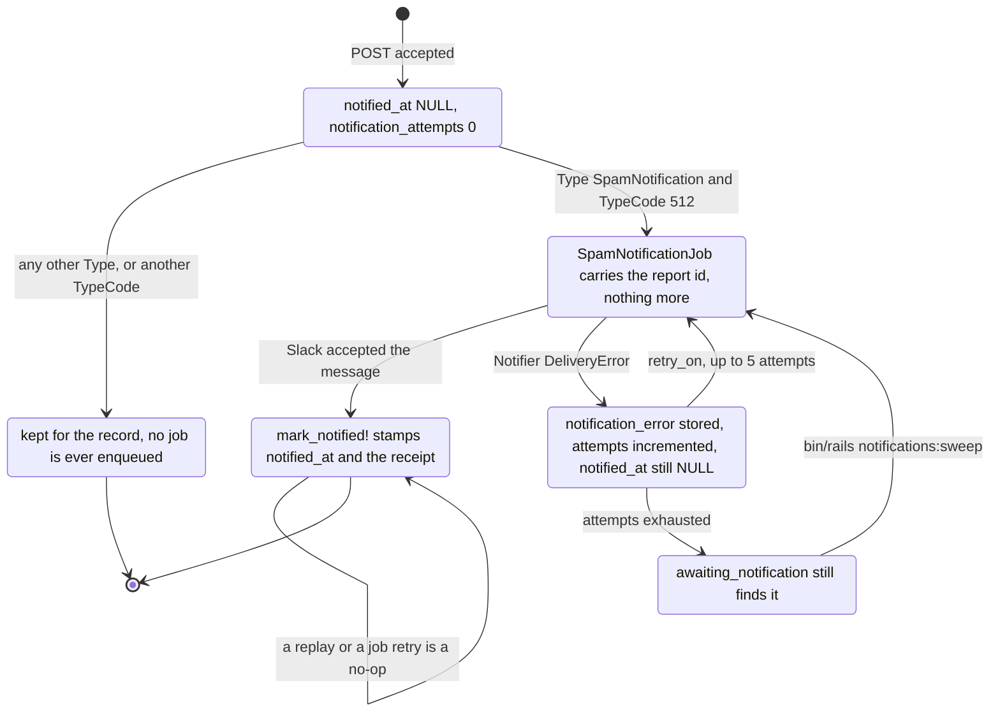

# notify-spam

A Rails 7 API-only service that receives a mail provider's bounce webhook — the payload is
Postmark's schema verbatim (`RecordType`, `Type`, `TypeCode`, `Email`, `From`, `BouncedAt`, …) —
stores every delivery event it is handed, and posts a Slack message to your own team for the one
event that needs a human: a spam complaint.

The name is narrower than the thing. It stores all four event types the provider sends
(`SpamNotification`, `HardBounce`, `SoftBounce`, `Delivery`), not only spam, and "notify" means
*post into a channel your team watches* — nothing here emails anybody, despite the generator's
`app/mailers/` directory still sitting in the tree. There is no UI and no read side: one `POST`,
one liveness probe, one table.

## The one request it serves

The provider posts its own PascalCase body. The response comes back in snake_case, before Slack has
been contacted. The command is the runnable local form; the response bodies are abridged from the
captured run in [`docs/api-transcripts.md`](docs/api-transcripts.md), which used port 8800 with
webhook auth enabled.

```console
$ curl -sS -X POST http://localhost:3000/api/v1/spam_reports \
    -H "Content-Type: application/json" \
    -d '{"RecordType":"Bounce","Type":"SpamNotification","TypeCode":512,
         "Name":"Spam notification","Tag":"welcome-email","MessageStream":"outbound",
         "Description":"The recipient marked the message as spam.",
         "Email":"annoyed@example.com","From":"alerts@example.com",
         "BouncedAt":"2023-03-14T17:29:39Z"}'

{"id":6, … ,"notified_at":null,"notification_attempts":0,
 "duplicate":false,"notification_enqueued":true}
< HTTP 201
```

Send that exact body again and the answer changes, because the event is recognised as one already
stored:

```console
{"id":6, … ,"notified_at":"2026-09-25T15:31:33.061Z",
 "duplicate":true,"notification_enqueued":false}
< HTTP 200
```

| Method | Path | Purpose |
| ------ | ---- | ------- |
| `POST` | `/api/v1/spam_reports` | Ingest one bounce or complaint event |
| `GET`  | `/up` | Liveness probe — queries the database, deliberately never Slack, so an outage at the notification provider cannot pull the container out of rotation |

`POST` answers `201` for a new event, `200` for a replay, `422` for an invalid payload, `400` for
a body that is not JSON, and `401` when webhook credentials are configured and not supplied. Every
one of those pairs, captured from a real local run, is in
[`docs/api-transcripts.md`](docs/api-transcripts.md).

## Delivery correctness is the whole problem

Ingesting a webhook is trivial. What is not trivial is that mail providers retry on any non-2xx
response, Slack sometimes refuses, and neither may turn into a duplicate alert or into a stored
report that claims to have been delivered when it was not. Four rules carry that, and each one has
a test that names it:

- **An event has an identity.** `SpamReport` derives a SHA-256 `event_key` from the fields that
  make two deliveries the same event, backed by a partial unique index. A replay is a cheap `200`
  with `duplicate: true` and no second row — `a replayed webhook is recognised and neither stored
  nor alerted twice`. Two concurrent deliveries that both get past the `SELECT` are resolved by
  catching `RecordNotUnique` and returning whichever row won — `loses the insert race gracefully
  and reports a duplicate`.
- **Delivery is recorded after it happens.** `notified_at` and `notification_receipt` are written
  only once Slack has accepted; a failure writes `notification_error` and increments
  `notification_attempts` and leaves `notified_at` nil — `a failed delivery does not mark the
  report notified`. The job returns early if the report is already notified — `an already-notified
  report is a no-op`.
- **Failures are isolated per report.** One job per report, so a revoked token or a missing
  channel for one alert cannot abort another — `one failing report does not stop the others from
  being delivered`. `retry_on` covers `Notifier::DeliveryError` and nothing else, so a bug in this
  codebase fails on the first attempt instead of being retried five times.
- **Only one event type alerts.** `SpamNotification` plus `TypeCode` 512 (Postmark's code for a
  spam complaint, overridable with `SPAM_TYPE_CODE`). A `SpamNotification` carrying a different
  code is stored and stays quiet — `a SpamNotification carrying a different type code is stored but
  not alerted on`.

Nothing opens a socket while the app boots: `config/initializers/notifications.rb` only reads
configuration, and `SlackNotifier` builds its client lazily on first delivery. The suite enforces
that with `WebMock.disable_net_connect!(allow_localhost: false)` — a change that put a live call
back on the ingestion path fails the suite rather than posting into a real channel.

Two rough edges the HTTP layer smooths over: an unrecognised `Type` escapes Active Record's enum
setter as an `ArgumentError`, so `SpamReport#report_type=` catches it and reports a validation
failure naming the four accepted values instead of an empty `500`; and `SnakeCaseParams` leaves an
unparsable body alone so `ApplicationController` can render a `400`.

## The life of one alert



The `Unsent → Queued` edge is why `bin/rails notifications:sweep` exists. Because `notified_at`
records what actually reached Slack rather than what was attempted, the pending set is exact and
re-queueing it cannot double-send.

One insert per request means there is no N+1 here and nothing to paginate. The three indexes on
`spam_reports` match the three real access patterns: the unique `event_key` lookup that runs on
*every* request, `[report_type, type_code, bounced_at]`, and a partial index on
`notified_at IS NULL` for the sweep. That reasoning is analytic — no throughput was measured.

## Running it locally

Ruby 3.1.3 (pinned in `.ruby-version` and the `Gemfile`) and a PostgreSQL you can connect to. No
Slack credentials are needed — with none set the app falls back to `NullNotifier` and logs the
alert instead of sending it.

```bash
bundle install
bin/rails db:prepare db:seed     # five representative events, idempotent
bin/rails server                 # port 3000
```

```bash
bin/rails test                             # 63 runs, 201 assertions, 0 failures
bundle exec rubocop                        # 48 files inspected, no offenses
bin/rails notifications:sweep              # re-queue alerts that never went out
bin/rails runner script/slack_preview.rb   # render the alert without sending it
```

Both result lines are reproduced in [`docs/test-output.md`](docs/test-output.md), which also records
two mutations of the delivery logic and the failures they produced — a green suite proves nothing
unless it can go red. [`docs/pipeline-evidence.md`](docs/pipeline-evidence.md) has the rendered
Slack alert, the stored rows, and the sweep. To post for real, copy
[`.env.example`](.env.example) to `.env` and set `SLACK_API_TOKEN` and `SLACK_CHANNEL_NAME`.

### Docker

`Dockerfile` (multi-stage, no compiler in the runtime image, non-root `rails` user, `HEALTHCHECK`
against `/up`) and `docker-compose.yml` (API on host port 8800, PostgreSQL 16, required secrets
declared as `${VAR:?}` so a missing one fails immediately) are provided:

```bash
SECRET_KEY_BASE=$(bin/rails secret) WEBHOOK_USERNAME=postmark WEBHOOK_PASSWORD=… \
  docker compose up --build
```

**Neither has been built or booted.** They were parse-checked with `docker compose config -q`
only. Treat them as a starting point, not as a verified deployment.

## Settings

Every variable is optional in development; the app runs with none of them set.

| Variable | Required | Default | Purpose |
| -------- | -------- | ------- | ------- |
| `SLACK_API_TOKEN` | No | _(unset)_ | Bot token with `chat:write`. Unset means alerts are logged, not sent. |
| `SLACK_CHANNEL_NAME` | No | _(unset)_ | Channel name or id. A bare name is prefixed with `#`. |
| `NOTIFIER` | No | `slack` | Which channel to use: any name in `NotifierRegistry` (`slack`, `null`). |
| `WEBHOOK_USERNAME` | In production | _(unset)_ | HTTP Basic username the provider must send. |
| `WEBHOOK_PASSWORD` | In production | _(unset)_ | HTTP Basic password the provider must send. |
| `ALLOW_UNAUTHENTICATED_WEBHOOK` | No | `false` | Set to `true` to let production boot with an open endpoint. |
| `SPAM_TYPE_CODE` | No | `512` | Provider type code that marks a spam complaint. |
| `ACTIVE_JOB_ADAPTER` | No | `async` | Active Job backend. `async` is in-process — see the gaps below. |
| `CORS_ORIGINS` | No | _(unset)_ | Comma-separated browser origins. Empty disables CORS entirely. |
| `DATABASE_URL` | In production | _(unset)_ | Standard Rails connection URL, overrides `config/database.yml`. |
| `SECRET_KEY_BASE` | In production | _(unset)_ | Required because `config/master.key` is not committed. |
| `RAILS_MAX_THREADS` | No | `5` | Puma threads and database pool size. |
| `PORT` | No | `3000` | Port Puma binds to. |

Webhook authentication is HTTP Basic — credentials embedded in the webhook URL, which is what
Postmark actually offers. It is **off when unconfigured**, so local development and the suite need
no secrets, but `config/initializers/webhook_security.rb` makes production *refuse to boot* without
`WEBHOOK_USERNAME` and `WEBHOOK_PASSWORD` unless `ALLOW_UNAUTHENTICATED_WEBHOOK=true` is set
explicitly: the endpoint fans out to a third party, so an open one lets a stranger fill your
channel. Both fields are compared through a fixed-length digest with `&` rather than `&&`, so
timing does not reveal which half was wrong.

CORS stays off unless `CORS_ORIGINS` is set, then allows only `POST`/`OPTIONS` on `/api/*`. No
browser is involved in a server-to-server webhook, so the generator's `origins "*"` bought nothing.

## Where the code lives, and where to extend it

Dependencies point inward. The controller knows HTTP and no rules; `SpamReportIngestion` owns the
rules; `SpamReport` owns validation, the provider's enum vocabulary and its own delivery
bookkeeping; the notifiers are the only code that knows Slack exists.

```
app/middlewares/snake_case_params.rb          PascalCase -> snake_case, at the edge
app/controllers/concerns/webhook_authentication.rb   shared-secret basic auth
app/controllers/api/v1/spam_reports_controller.rb    HTTP adapter: params in, status out
app/services/spam_report_ingestion.rb         validate -> de-duplicate -> persist -> enqueue
app/models/spam_report.rb                     validation, enum, event_key, delivery state
app/jobs/spam_notification_job.rb             out-of-band delivery, retry, idempotency
app/notifiers/                                notifier.rb is the contract, registry is the seam
lib/tasks/notifications.rake                  notifications:sweep
script/slack_preview.rb                       render an alert without sending it
```

`NotifierRegistry` is the one extension seam, and it is the one a future developer would actually
reach for. Adding email, PagerDuty or an internal webhook is a class that implements
`Notifier#deliver` and raises `Notifier::DeliveryError` on rejection, plus one line:

```ruby
NotifierRegistry.register(:pagerduty, "PagerdutyNotifier")
```

No change to the controller, the service, the job or the model. Classes are registered by name and
resolved lazily, so registration works from an initializer without fighting Zeitwerk. A channel
reporting `configured? == false` is swapped for `NullNotifier` rather than raising — that is why an
unconfigured deployment records events instead of crashing. The suite drives its own doubles
through the same seam, so a broken seam breaks the tests.

## Known gaps

- **Write-only.** Events go in and cannot be read back: no list, no search, no analytics, no UI.
- **The default queue is not durable.** `ACTIVE_JOB_ADAPTER=async` runs jobs in-process and loses
  anything queued when the process exits — visible in `docs/pipeline-evidence.md`, where the seed's
  alerts survive only because `notifications:sweep` can find them again. A real deployment wants
  Sidekiq, GoodJob or Solid Queue.
- **A shared secret is not a signature.** A provider that signs its payloads would warrant
  verifying the signature instead.
- **No rate limiting.** A flood of *valid* events is ingested as fast as the database allows.
- **Retention is unbounded** and the alert text is a single `I18n` string — no blocks, threading or
  per-channel routing.
- **Generator weight.** `require "rails/all"` still loads Action Cable, Action Mailbox, Action Text
  and Active Storage, none of which this service uses, along with the `app/channels`, `app/mailers`
  and `config/cable.yml` they expect. Explicit requires would boot faster and ship smaller.
- **Docker is unbuilt** — see the note above.
