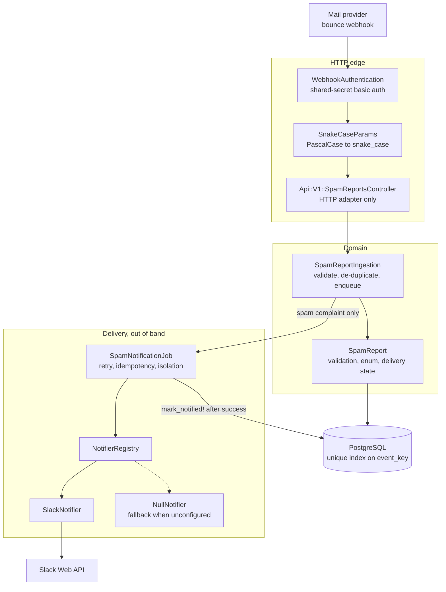
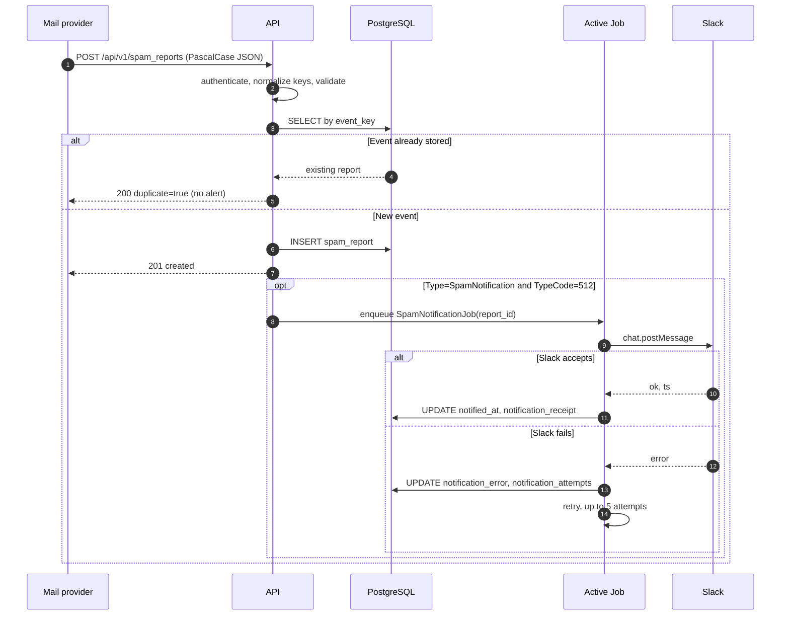

# Spam Notifier

A small Rails API that receives a mail provider's bounce webhook (the payload shape is
Postmark's: `RecordType`, `Type`, `TypeCode`, `Email`, `From`, `BouncedAt`…), stores every
delivery event, and raises a Slack alert for the one event type that needs a human —
a spam complaint.

It is a webhook receiver, not a dashboard: one `POST` endpoint plus a health probe. The
interesting part is delivery correctness — providers retry, Slack fails, and neither may
turn into a duplicate alert or a report that claims to have been sent when it was not.

---

## Captured output

There is no UI. The transcripts below come from a real local run; the full captures live in
[`docs/`](docs).

| Capture | What it shows |
| ------- | ------------- |
| [`docs/api-transcripts.md`](docs/api-transcripts.md) | Every request/response pair: ingest, replay, rejection, auth |
| [`docs/pipeline-evidence.md`](docs/pipeline-evidence.md) | The rendered Slack alert, what ends up stored, and the sweep |
| [`docs/test-output.md`](docs/test-output.md) | Test and lint runs, plus the mutations that prove the suite fails |

A spam complaint is stored and an alert is queued:

```console
$ curl -sS -u postmark:****** -X POST http://127.0.0.1:8800/api/v1/spam_reports \
    -H "Content-Type: application/json" -d '<payload>'
{"id":6,...,"notified_at":null,"notification_attempts":0,"duplicate":false,"notification_enqueued":true}
< HTTP 201
```

The provider retries the same event; it is recognised, and nothing is sent twice:

```console
$ curl -sS -u postmark:****** -X POST http://127.0.0.1:8800/api/v1/spam_reports \
    -H "Content-Type: application/json" -d '<payload>'
{"id":6,...,"notified_at":"2026-09-25T15:29:04.512Z","duplicate":true,"notification_enqueued":false}
< HTTP 200
```

And this is the alert itself, produced by driving the real `SlackNotifier` against a
recording double (`bin/rails runner script/slack_preview.rb`):

```console
chat.postMessage channel=#email-alerts
text:
  | Request with Spam Payload detected!
  |  *Type*: SpamNotification
  |  *Email*: annoyed@example.com
  |  *Description*: The recipient marked the message as spam.
receipt: slack:1678814979.000100
```

---

## Architecture



Dependencies point inward. The controller knows HTTP and nothing else; `SpamReportIngestion`
owns the rules; `SpamReport` owns validation and its own delivery bookkeeping; the notifiers
are the only code that knows Slack exists, and they are reached through a registry so the
layers above never name a provider.

## Request flow



The response is returned before Slack is contacted. A Slack outage therefore costs the
provider nothing: it still gets its `201`, and the alert is retried in the background.

---

## Quickstart

Requires Ruby 3.1.3 and a running PostgreSQL. No Slack credentials are needed — without
them the app logs the alert instead of sending it.

```bash
bundle install
bin/rails db:prepare db:seed
bin/rails server -p 3000
```

```bash
curl -sS -X POST http://localhost:3000/api/v1/spam_reports \
  -H "Content-Type: application/json" \
  -d '{"RecordType":"Bounce","Type":"SpamNotification","TypeCode":512,
       "Name":"Spam notification","Tag":"welcome-email","MessageStream":"outbound",
       "Description":"The recipient marked the message as spam.",
       "Email":"annoyed@example.com","From":"alerts@example.com",
       "BouncedAt":"2023-03-14T17:29:39Z"}'
```

To actually post to Slack, copy `.env.example` to `.env` and fill in `SLACK_API_TOKEN`
(a bot token with `chat:write`) and `SLACK_CHANNEL_NAME`.

### Endpoints

| Method | Path | Purpose |
| ------ | ---- | ------- |
| `POST` | `/api/v1/spam_reports` | Ingest one bounce/spam webhook event |
| `GET`  | `/up` | Liveness probe; checks the database only |

`POST` answers `201` for a new event, `200` for a replay, `422` for an invalid payload,
`400` for a body that is not JSON, and `401` when webhook credentials are configured and
not supplied.

---

## Configuration

Every variable is optional in development; the app runs with none of them set.

| Variable | Required | Default | Purpose |
| -------- | -------- | ------- | ------- |
| `SLACK_API_TOKEN` | No | _(unset)_ | Slack bot token with `chat:write`. Unset means alerts are logged, not sent. |
| `SLACK_CHANNEL_NAME` | No | _(unset)_ | Channel name or id to post into. A bare name is prefixed with `#`. |
| `NOTIFIER` | No | `slack` | Which channel to use: any name in `NotifierRegistry` (`slack`, `null`). |
| `WEBHOOK_USERNAME` | In production | _(unset)_ | HTTP Basic username the provider must send. |
| `WEBHOOK_PASSWORD` | In production | _(unset)_ | HTTP Basic password the provider must send. |
| `ALLOW_UNAUTHENTICATED_WEBHOOK` | No | `false` | Set to `true` to let production boot with an open endpoint. |
| `SPAM_TYPE_CODE` | No | `512` | Provider type code that marks a spam complaint. Postmark uses 512. |
| `ACTIVE_JOB_ADAPTER` | No | `async` | Active Job backend. `async` is in-process; see Limitations. |
| `CORS_ORIGINS` | No | _(unset)_ | Comma-separated browser origins. Empty disables CORS entirely. |
| `DATABASE_URL` | In production | _(unset)_ | Standard Rails connection URL; overrides `config/database.yml`. |
| `SECRET_KEY_BASE` | In production | _(unset)_ | Rails secret. Required because `config/master.key` is not committed. |
| `RAILS_MAX_THREADS` | No | `5` | Puma threads and database pool size. |
| `PORT` | No | `3000` | Port Puma binds to. |

Production refuses to boot without `WEBHOOK_USERNAME` and `WEBHOOK_PASSWORD` unless
`ALLOW_UNAUTHENTICATED_WEBHOOK=true` is set explicitly. The endpoint triggers outbound
Slack messages, so an open one is a way for a stranger to fill your channel.

---

## Development

```bash
bundle install
bin/rails db:prepare        # development database
bin/rails test              # 63 tests, no network access
bundle exec rubocop         # lint; rubocop-rails + rubocop-minitest
bin/rails notifications:sweep      # re-queue alerts that never went out
bin/rails runner script/slack_preview.rb   # print the alert without sending it
```

The suite calls `WebMock.disable_net_connect!` in `test/test_helper.rb`, so **no test can
reach Slack** — a change that put a live call back on the ingestion path would fail the
suite rather than post into a real channel. `SlackNotifierTest` still drives the real
`slack-ruby-client` through a WebMock stub, so the HTTP request the app would make is
asserted, not mocked away.

### Docker

`Dockerfile` (multi-stage, non-root runtime user, healthcheck on `/up`) and
`docker-compose.yml` (API on host port 8800 plus PostgreSQL) are provided:

```bash
SECRET_KEY_BASE=$(bin/rails secret) WEBHOOK_USERNAME=postmark WEBHOOK_PASSWORD=... \
  docker compose up --build
```

These were written and parse-checked with `docker compose config`; they have not been
built or booted.

---

## Project structure

```
app/
  controllers/
    api/v1/spam_reports_controller.rb  HTTP adapter: params in, status code out
    concerns/webhook_authentication.rb shared-secret basic auth for the webhook
    health_controller.rb               liveness probe (database only)
  middlewares/
    snake_case_params.rb               PascalCase -> snake_case at the edge
  models/
    spam_report.rb                     validation, enum, event key, delivery state
  services/
    spam_report_ingestion.rb           the ingestion rules, in one place
  jobs/
    spam_notification_job.rb           out-of-band delivery: retry, idempotency
  notifiers/
    notifier.rb                        the contract every channel implements
    notifier_registry.rb               the extension seam
    slack_notifier.rb                  the only class that knows about Slack
    null_notifier.rb                   fallback when nothing is configured
config/
  initializers/notifications.rb        channel config; opens no sockets at boot
  initializers/webhook_security.rb     production refuses an unprotected endpoint
  initializers/cors.rb                 CORS off unless CORS_ORIGINS is set
db/migrate/                            schema, including the event_key unique index
docs/                                  captured transcripts quoted in this README
script/slack_preview.rb                render an alert without sending it
test/                                  63 tests; network blocked by WebMock
```

---

## Design notes

**Nothing talks to the network at boot.** The original `config/initializers/slack.rb`
raised unless `SLACK_API_TOKEN` was set and then called `SLACK_CLIENT.auth_test` — a live
HTTPS request to slack.com — while loading initializers. That made the app unbootable and
the test suite unrunnable without valid credentials and internet. The Slack client is now
built lazily inside `SlackNotifier`, and an unconfigured channel degrades to
`NullNotifier` instead of raising.

**Delivery is recorded after it happens, not before.** `notified_at` is written only once
Slack has accepted the message. The job checks `notified?` before sending, so a retry or a
replayed webhook cannot produce a second alert, and a failure leaves an accurate
`notification_error` and `notification_attempts` rather than a report that claims to have
been delivered.

**Replays are a first-class case.** Providers retry a webhook on any non-2xx response.
Each event gets a SHA-256 `event_key` derived from its identifying fields, backed by a
unique index. A replay is a cheap `200` with `duplicate: true`; a race between two
concurrent deliveries is lost gracefully by catching `RecordNotUnique` and returning the
row that won.

**The bottleneck was the request cycle, not the database.** This service does one insert
per request; there is no N+1 to find. What it *did* do was make a synchronous HTTPS call to
Slack inside `after_create_commit`, so every request's latency was Slack's latency and any
Slack error propagated out of the transaction callback — the caller got a `500` even though
the row was committed, which made the provider retry and create a duplicate. Moving
delivery to `SpamNotificationJob` decouples ingest throughput from Slack entirely; the
indexes added alongside it (`event_key` unique, `[report_type, type_code, bounced_at]`, and
a partial index on un-notified rows) keep the replay lookup and the sweep constant-time as
the table grows.

**Failures are isolated per report.** One job per report means a revoked token or a
channel-not-found for one alert cannot abort any other. `retry_on` covers
`Notifier::DeliveryError` only, so a genuine bug in our own code fails loudly on the first
attempt instead of being retried five times.

**One extension seam, not five.** `NotifierRegistry` is the seam a future developer would
actually reach for: adding email, PagerDuty or an internal webhook is one class that
implements `deliver` plus one `register` call, with no change to the controller, the
service or the job. The test suite uses that seam for its own doubles, which keeps it
honest.

**The enum vocabulary is the provider's.** `Type` is stored as `report_type` because
`type` is reserved by Active Record for single-table inheritance, and aliased back so the
webhook's own field name still works. An unrecognised `Type` used to raise `ArgumentError`
out of the enum setter and return an empty `500`; it is now an ordinary validation error
with a message naming the four accepted values.

---

## Limitations

- **One endpoint.** Events can be ingested but not read back: there is no list, search or
  analytics API and no UI. An earlier version of this README advertised "analyze spam
  notifications"; no such endpoint ever existed.
- **The default queue is not durable.** `ACTIVE_JOB_ADAPTER=async` runs jobs in-process and
  loses anything queued when the process exits. `bin/rails notifications:sweep` re-queues
  alerts that never went out, but a real deployment should point `ACTIVE_JOB_ADAPTER` at
  Sidekiq, GoodJob or Solid Queue.
- **Authentication is a shared secret, not a signature.** Postmark offers HTTP Basic
  credentials in the webhook URL, which is what this implements. A provider that signs its
  payloads would warrant verifying the signature instead.
- **No rate limiting.** A flood of valid events will be ingested as fast as the database
  allows. Rack::Attack or an upstream limit would be the next addition.
- **Alert text is fixed.** The Slack message is a single `I18n` string with no formatting
  blocks, threading, or per-channel routing.
- **Retention is unbounded.** Reports are never pruned; a production deployment would want
  a retention policy or partitioning.
- **Docker is unbuilt.** The image and compose file are written to a good standard but have
  only been parse-checked, not built or run.
